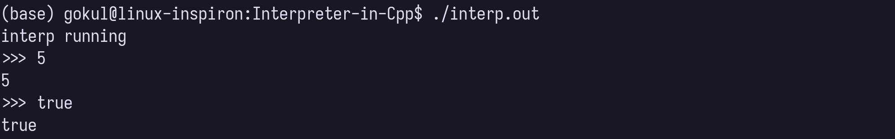
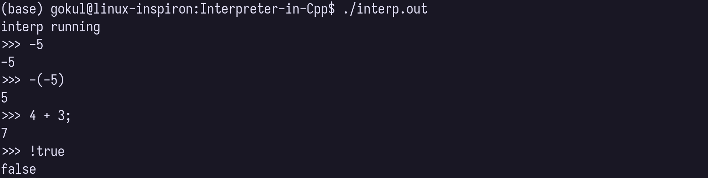
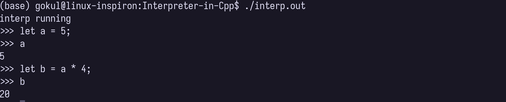
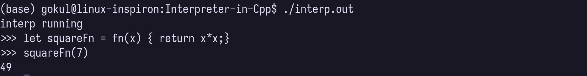
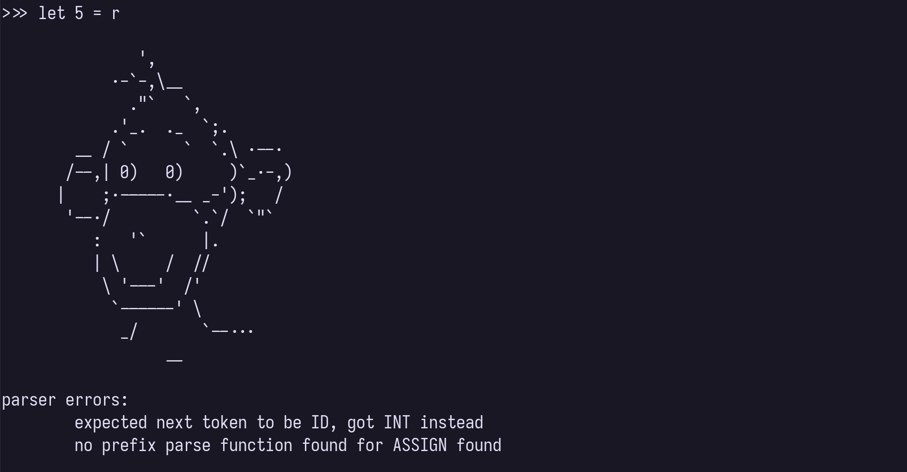
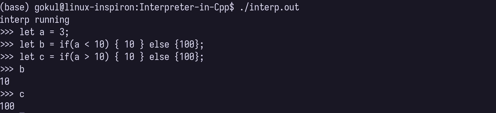

# Monkey Language in C++  

```
               ',
            .-`-,\__
              ."`   `,
            .'_.  ._  `;.
        __ / `      `  `.\ .--.
       /--,| 0)   0)     )`_.-,)
      |    ;.-----.__ _-');   /
       '--./         `.`/  `"`
          :   '`      |.
          | \     /  //
           \ '---'  /'
            `------' \
             _/       `--...
                  __
```

## Introduction

This is a from scratch implementation of Monkey Language interpreter, inspired from Thorsten Ball's book 
"Writing Interpreter in Go". This project gave me an opportunity to understand compilers and interpreters in application point of view. I learnt about Pratt Parsing, Interfaces via Abstract classes, std::function and function pointers, Smart pointers and many more cool concepts. 

## Installation
This following interpreter was implemented and tested in linux mint 21 and using clang20 compiler.

It has following dependency: `libfmt.so`, install it via instructions [here](https://askubuntu.com/questions/1205765/c-fmt-library-installation-is-not-working)

To install you can just run:
```
make all
./interp.out
```

## Features supported
- Integer 
- Unary, infix and prefix operator
- Variables 
- Functions and return statements
- Parsing errors
- Conditionals

### 1. Integer Support


### 2. Unary, infix and prefix operator


### 3. Variable support using let


### 4. Functions and return statement


### 5. Parsing errors 


### 6. Conditionals


## Features to implement
- [ ] string support
- [ ] loops 
- [ ] Builtin Functions 
- [ ] Arrays